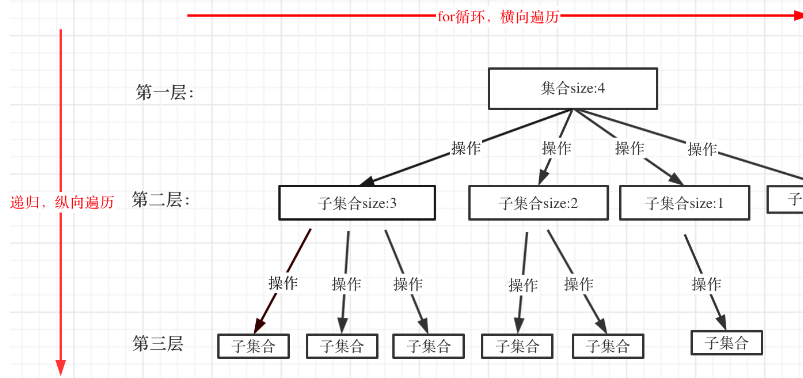

### 组合

给定两个整数 n 和 k，返回范围 `[1, n]` 中所有可能的 k 个数的组合。

你可以按 任何顺序 返回答案

### 示例

```
输入：n = 4, k = 2
输出：
[
  [2,4],
  [3,4],
  [2,3],
  [1,2],
  [1,3],
  [1,4],
]

输入：n = 1, k = 1
输出：[[1]]
```

### 提示

- `1 <= n <= 20`
- `1 <= k <= n`


-----------------------------------------------------

### 回溯法

回溯法解决的问题都可以抽象为树形结构

因为回溯法解决的都是在集合中递归查找子集，**集合的大小就构成了树的宽度，递归的深度，都构成的树的深度**



for循环就是遍历集合区间，可以理解一个节点有多少个孩子，这个for循环就执行多少次

for循环可以理解是横向遍历，backtracking(递归) 就是纵向遍历，这样就把这棵树全遍历完了

### 回溯算法模板

```
func backtracking(路径, 选择列表) {
  if 终止条件 {
    存储结果
    return
  }

  for 选择本层集合中元素 {
    处理节点
    backtracking(路径, 选择列表) ----> 递归
    回溯, 撤销处理结果
  }
}
```

